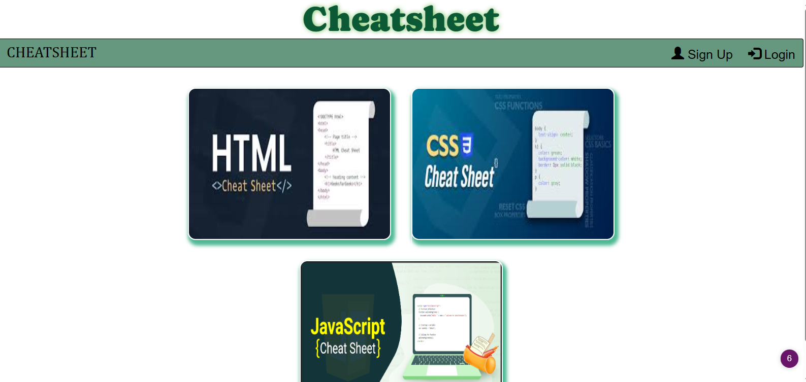

# CheatsheetGen
[Link to site](https://obscure-stream-33374-4c4296c6212a.herokuapp.com/)

[link to project management board](https://github.com/users/Teelsam/projects/1/views/1)

## Team Name
The Cozy-Coders

## Table of Contents

* [Description](#desciption)

* [Usage](#usage)

* [Contributing](#contributing)

* [Packages](#packages)

* [Questions](#questions)

* [References](#references)

## Description 

Here our group _Cozy-Coders_ have assembled only the most intriguing, esoteric and most importantly, coveted facts about web development that any soul, living or dead, would want to encounter. How did we manage this feat of human ingenuity? Through burdensome trials and scouring of  info sites and sites of documentation. All these hurdles we eagerly surmounted and surpassed. Here our site asks the user to log in to see the treasure troves of cheatsheet, hints, and clues small and large about how you too can learn to create a website. 

## Usage

Opening the sites url you are asked to create an account, once created, login and explore the sites subcontents by catagory, HTML hints, CSS tricks and JavaScript clues! 

## Contributing

[Sam Teel](https://github.com/Teelsam)  

[Kaur Kirandeep](https://github.com/MK0999)  

[Emmanuel Appiagyei](https://github.com/WDverse)
 
## Packages

NPM Packages:  

    bcrypt: 5.1.0,  

    bootstrap: 5.3.1,  

    connect-session-sequelize: 7.1.7,  

    dotenv: 16.3.1,  

    eslint: 8.46.0,  

    express: 4.18.2,  

    express-handlebars: 7.1.1,  

    express-session: 1.17.3,  

    mysql2: 3.5.2  

    nodemon: 3.0.1  

    sequelize: 6.32.1  
    

## Questions

[The GitHub Repo](https://github.com/Teelsam/CheatSheetGen)

## References 

[Handlebars.js](https://handlebarsjs.com/)